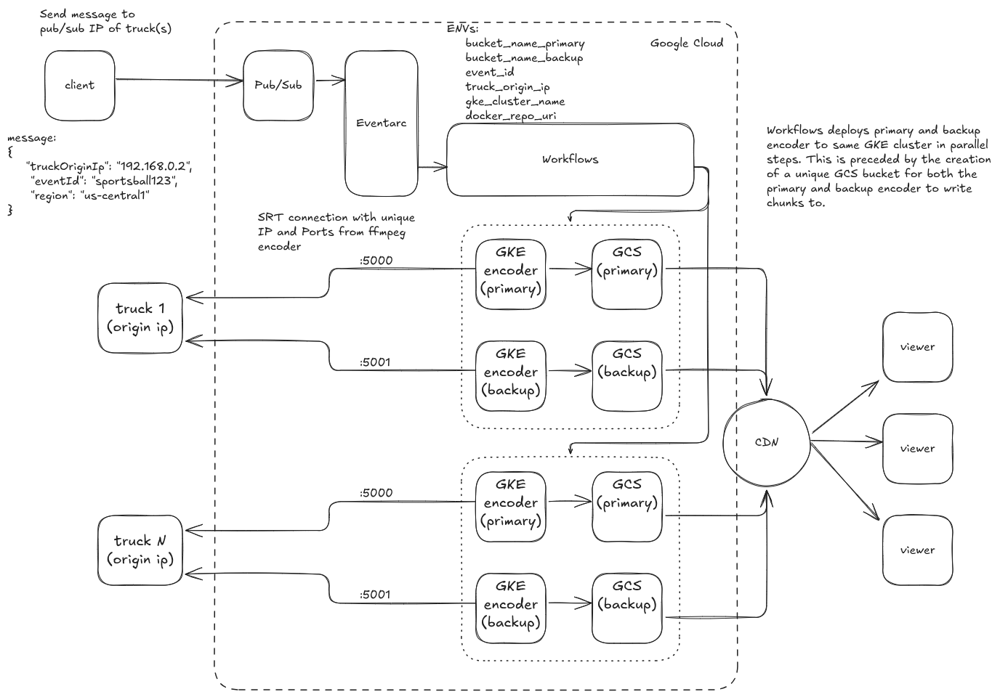

# Video Encoding on Google Cloud

This is an example architecture to build out and benchmark a simple live stream
video encoding on Google Cloud's GKE.

## Architecture


## Technology Used
- [GitHub CLI](https://github.com/cli/cli#installation)
- [Terraform](https://www.terraform.io/downloads.html)
- [Artifact Registry](https://cloud.google.com/artifact-registry/docs)
- [GitHub Actions](https://docs.github.com/en/actions)
- [GKE Autopilot](https://cloud.google.com/kubernetes-engine/docs/concepts/autopilot-overview)
- [Google Workflows](https://cloud.google.com/workflows/docs/overview)
- [Eventarc](https://cloud.google.com/eventarc/docs/overview)
- [kubectl](https://kubernetes.io/docs/tasks/tools/install-kubectl/)
- [gcloud](https://cloud.google.com/sdk/docs/install)

## Initializing Your Project

These instructions walk you through setting up your environment for this
project.

You will need to clone this repository to the machine you want to use to set up
your Google Cloud environment.

> **NOTE:** We recommended using Google Cloud Shell instead of your local
> laptop. Cloud Shell has all the tooling you need already pre-installed.

1. First authenticate to Google Cloud:

  ```bash
  gcloud auth application-default login
  ```

2. Create a new project (skip this if you already have a project created):

  ```bash
  gcloud projects create <your-project-id>
  ```

3. Set the new project as your context for the `gcloud` CLI:

  ```bash
  gcloud config set project <your-project-id>
  ```

4. Check if your authentication is ok and your project id is set:

  ```bash
  gcloud projects describe <your-project-id>
  ```

> __Note:__ You should see your `projectId` listed with an `ACTIVE` state.

5. Setup your unique `.env` variables to be used throughout the setup
process

  ```bash
  bash ./scripts/setup-env.sh
  ```

6. Finally, enable all the needed Google Cloud APIs by running this script:

  ```bash
  bash ./scripts/enable-api.sh
  ```

During this step you will be prompted for a couple inputs relative to your unique project. Most
inputs will contain defaults that might already be set, in which case go ahead and press [ENTER]
to accept and continue.

1. The GitHub username/organization. This is the value used above when you cloned your fork.
2. The name of the GitHub repository, by default this is set to `gke-github-deployment`.
3. Your unique Google Cloud project ID.
4. Defaut region location for Google Cloud setup.
5. A short (3-5 char) identifier for your cloud resources (e.g. gcp).

## (Optional) Setting up GitHub Actions

Instructions for setting up and using GitHub Actions can be [found here](./github-actions/README.md).

## Provisioning Infrastructure (encoder)

The automation for this infrastructure focuses on the encoder setup running on
Google Cloud's GKE. Deployments for primary and backup encoders are automated
through Workflows. Workflows subscribes to a topic provisioned by Eventarc that
pushes messages from Pub/Sub.

1. Run the `terraform` CLI on the command line directly. [See instructions here.](./terraform/README.md)

2. Use a GitHub Action to run all the Terraform configuration files. [See instructions here.](./github-actions/README.md)

## Creating the "truck"

In order to create a stream we will need to simulate an on-site event, further
refered to as a truck. If you alread have a simulation in place, you may kickoff
the encoder setup by sending the following message to Pub/Sub

```bash
gcloud pubsub topics publish encoder-topic \
  --message='{"truckOriginIp": "0.0.0.0", "eventId": "sportsball-2025-03-14-v1", "region": :"us-central1"}'
```

### Truck infrascture on Google Cloud

In order to simulate a truck on Google Cloud, you can run through the following
setup that stands up a Google Compute Engine instance and listens for the
encoder to stream to.

Create and event and specify its location.

```bash
export EVENT="sportsball1234"
export TRUCK_LOCATION="us-central1"
export PROJECT_ID=$(gcloud config get-value project)
```

If you do not have a default VPC, go ahead an create one
```bash
gcloud compute networks create default \
    --subnet-mode=auto \
    --bgp-routing-mode=global
```

Reserve and static IP Adress to use for out "event"

```bash
gcloud compute addresses create ${EVENT}-ip --region=${TRUCK_LOCATION}
```

Declare some environment variables to use in the creation of our instance.

```bash
export TRUCK_IP=`gcloud compute addresses list --filter=name=${EVENT}-ip --format='value(address)'`
export TRUCK_PRIMARY="${TRUCK_IP}:5000"
export TRUCK_BACKUP="${TRUCK_IP}:5001"

export TIMESTAMP=`date +%Y%M%dt%H%M`
```

Upload truck starter script to GCS to be used on GCE creation.

```bash
gcloud storage buckets create gs://bkt-${PROJECT_ID}-truck-startup --location=${TRUCK_LOCATION}
gsutil cp ./scripts/truck-startup.sh gs://bkt-${PROJECT_ID}-truck-startup
```

```bash
gcloud compute instances create srt-stream-sender-${EVENT}-$TIMESTAMP \
  --zone=${TRUCK_LOCATION}-c \
  --machine-type=n2d-highmem-4 \
  --maintenance-policy=MIGRATE \
  --scopes=https://www.googleapis.com/auth/cloud-platform \
  --tags=srt-truck \
  --image-project=ubuntu-os-cloud \
  --image-family=ubuntu-2204-lts \
  --boot-disk-size=100 \
  --boot-disk-type=pd-balanced \
  --network=default \
  --shielded-secure-boot \
  --address=${TRUCK_IP} \
  --instance-termination-action=DELETE \
  --metadata-from-file=startup-script=./scripts/truck-startup.sh
  # --metadata=startup=gs://bkt-${PROJECT_ID}-truck-startup/truck-startup.sh
```

Kickoff encoding workflow

```bash
gcloud pubsub topics publish encoder-topic \
  --message="{\"truckOriginIp\": \"${TRUCK_IP}\", \"eventId\": \"${EVENT}\", \"region\": \"${TRUCK_LOCATION}\"}"
```


```bash
status="none"
while [ "${status}" != "stopping" ]; do
  statusnew="`gcloud compute instances list --filter=srt-stream-sender-${EVENT} |grep STATUS|awk '{print $2}'`"
  if [ "${statusnew}" == "RUNNING" ]; then
     prim_files=`gcloud storage ls gs://${GCS_OUT_NAME}/ffmpeg-${EVENT}* |wc -l`
     sec_files=`gcloud storage ls gs://${GCS_OUTBKP_NAME}/ffmpeg-${EVENT}* |wc -l`
     status="running"
     echo "Status is running"
     echo
     date
     echo
     echo -e "Files generated \nPrimary Bucket = $prim_files \nBackup Bucket = $sec_files\n"
     sleep 5
     kubectl -n ffmpeg get pods -l app=ffmpeg-${EVENT};echo; kubectl -n ffmpeg top pods -l app=ffmpeg-${EVENT}; echo; gcloud compute instances list --filter=srt-stream-sender-${EVENT}; echo; kubectl -n ffmpeg logs -l app=ffmpeg-${EVENT} --tail=1
     sleep 5
  fi
  if [ "${status}" = "running" ]; then
     if [ "${statusnew}" == "STOPPING" ]||[ "${statusnew}" == "" ]; then
        status="stopping"
        echo "VM stopping"
        gcloud compute instances list --filter=srt-stream-sender-${EVENT}
     fi
  fi
done
```
